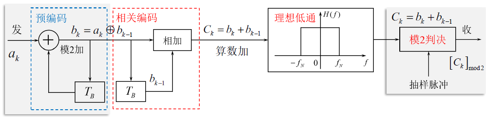

# 时域均衡和部分响应技术

## 均衡概述

### 目的

减小码间干扰

### 频域模型

$$
H(\omega) = G_T(\omega)C(\omega)G_R(\omega)
$$

其中，$G_T(\omega)$是发滤波器频率响应、$C(\omega)$是信道频率响应、$G_R(\omega)$是收滤波器频率响应。

## 均衡技术原理

### 频域均衡

$$
H'(\omega) = H(\omega)T(\omega)
$$

其中，$T(\omega)$是频域均衡器的频率响应。

而且，
$$
\sum_{\boldsymbol{i}}^{}{H'\left( \omega +\frac{2\pi i}{T_B} \right) =}T_B,\left| \omega \right|\leqslant \frac{\pi}{T_B}
$$

### 时域均衡

$$
h\left( t \right) *h_T\left( t \right) =h^{\prime}\left( t \right) 
\\
x\left( t \right) *h_T\left( t \right) =y\left( t \right) 
\\
$$

$$
y\left( kT_B \right) =h^{\prime}\left( kT_B \right) =\left\{ \begin{matrix}
	1&		k=0\\
	0&		k\ne 0\\
\end{matrix} \right. 
$$

#### 无ISI时域均衡器的冲激响应

$$
h_T\left( t \right) =\sum_{n=-\infty}^{+\infty}{C_n\delta \left( T-nT_B \right)}
$$

$$
T(\omega) =\sum_{n=-\infty}^{+\infty}{C_ne^{-jn\omega T_B}}
$$

其中，$C_n$与$H(\omega)$有关，就是抽头系数。

### 输出信号

$$
y(t) = x\left( t \right) *h_T\left( t \right) =\sum_{n=-\infty}^{+\infty}C_nx(t-nT_B)
$$

理论上无限抽头的时域均衡器可以完全消除ISI，但是物理不可实现。实际使用中常用$2N+1$个抽头的横向滤波器。
$$
y(t) = x\left( t \right) *e\left( t \right) =\sum_{n=-N}^{N}C_nx(t-nT_B)
$$
其中，$C_i$与$H(\omega)$有关。
$$
e\left( t \right) =\sum_{i=-N}^{N}{C_i\delta \left( T-iT_B \right)}
$$
达到的效果是：
$$
y(k) =\sum_{i=-N}^{N}C_ix_{k-i}
$$
当$i=0$时就是本码元的抽样值；当$i\ne 0$时就是本码元的抽样值。

## 均衡效果衡量法则

### 峰值失真准则

$$
D = \frac{1}{y_0}\sum_{k\ne 0}|y_k|
$$

所有码间干扰的值除以当前的码元值。

### 均方失真准则

$$
e = \frac{1}{y_0^2}\sum_{k\ne 0}|y_k^2|
$$

所有码间干扰值的平方除以当前的码元值的平方。

两种准则得出的结果越低越好。

## 迫零均衡算法

### 原理

（后续补充）

### 结论

$$
X = \begin{bmatrix}
 x_0 & x_{-1} & n_{-2}\\
 x_1 & x_0 & x_{-1}\\
 x_2 & x_1 & x_0
\end{bmatrix},C = \begin{bmatrix}
 c_{-1}\\
 c_0\\
 c_1
\end{bmatrix},Y = \begin{bmatrix}
 0\\
 1\\
 0
\end{bmatrix}
$$

而且当迫零均衡成功时，有：
$$
XC=Y
$$
通过该矩阵运算反求$C$矩阵。

## 部分响应系统概述

### 设计目标

- 提高频带利用率：理论极限$2Baud/Hz$
- 改善频谱特性：压缩传输频带
- 加快响应波形尾部的衰减：降低对定时的要求

核心目的是将“理想低通滤波器”（尾部收敛慢，定时要求高）和余弦滚降（带宽变大，频带利用率降低）结合在一起。

设计思想是通过**相关编码**有控制的在某些抽样时刻**引入码间串扰**。由于引入的码间串扰是有规则的，可以在接受端剔除。

## 第I类部分响应

### 数学表达

$$
h\left( kT_B \right) =\left\{ \begin{matrix}
	1&		k=0\\
	0&		k\ne 0\\
\end{matrix} \right. \xrightarrow{\text{放宽}}h^{\prime}\left( kT_B \right) =\left\{ \begin{matrix}
	1&		k=0,1\\
	0&		k\ne 0\\
\end{matrix} \right.
$$

### 设计思考

两个拖尾极性相反的$Sa$函数相加，两个函数最高点的时间差为$T_B$。

（此处应有图）

### 实现方法——相关编码

可以看到每个$Sa$函数仅在$k=1$时对下一个$Sa$函数产生码间串扰。

### 数学过程分析

#### 相关编码输入信号——红色虚线框部分

$$
h_1(t) = \delta(t) + \delta(t-T_B) \Longleftrightarrow  H_1(\omega) = 1+e^{-j\omega T_B}
$$

#### 理想低通滤波器

$$
h(t) = Sa(\frac{\pi t}{T_B}) \Longleftrightarrow H(\omega )=\left\{ \begin{matrix}
	T_B&		,\left| \omega \right|\leqslant \frac{\pi}{T_B}\\
	0&		,\left| \omega \right|>\frac{\pi}{T_B}\\
\end{matrix} \right.
$$

==此处可以配图==

#### 部分响应信号的频谱——前两者频域乘积

$$
G(\omega) = \left\{ \begin{matrix}
	(1+e^{-j\omega T_B})T_B&		,\left| \omega \right|\leqslant \frac{\pi}{T_B}\\
	0&		,\left| \omega \right|>\frac{\pi}{T_B}\\
\end{matrix} \right.
$$

### 频谱特点——结论

- 系统带宽：$B=\frac{R_B}{2}=f_N$
- 传码率：$R_B = \frac{1}{T_B}$
- 频带利用率：$\eta  = \frac{R_B}{B} = 2$

- 不仅频谱是滚降的，而且对定时要求降低了。

### 接收端抽样判决

由于$a_k = C_k - a_{k-1}$，当接收到的$C_k$出错时，可能会出现差错传播的现象。

解决差错传播的方案：**预编码**。

故，整个第一类部分响应的完整流程图为：

- 预编码：$b_k=a_k\oplus b_{k-1}$

- 相关编码：$b_k=a_k\oplus b_{k-1}$

- 抽样判决（模2加）：$b_k=a_k\oplus b_{k-1}$

  ==注意：$b_k$的取值有时为$\pm 1$，需要根据实际情况做出调整。==

## 第IV类部分响应

### 设计思路

当前码元仅对下下一个码元产生干扰。

### 数学过程

把所有的$b_{k-1}$更改为$b_{k-2}$即可。

### 频谱特点

- 基本和第I类部分响应相同
- 无直流分量、低频分量较小，适合边带滤波。（SSB、VSB类）
